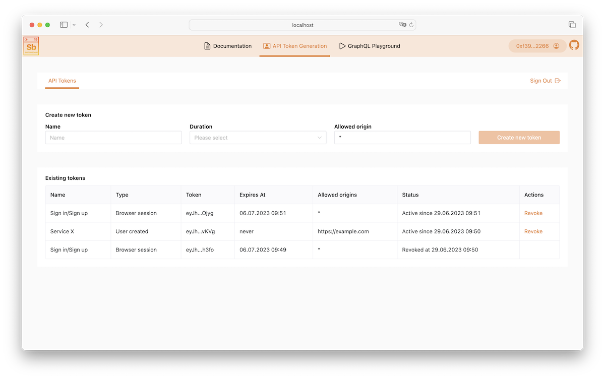

[](https://github.com/makerdao-ses/switchboard-boilerplate/actions/workflows/ci.yaml)
[](https://www.gnu.org/licenses/agpl-3.0)

# Powerhouse Switchboard

Open-source API over the [document model](https://github.com/makerdao-ses/document-model-libs) made to be developer- and analyst-friendly.



## Project structure

-   [`/api`](./api) directory contains the core logic that creates the API over the database
-   [`/frontend`](./frontend) directory contains the frontend-related code
-   [`./wundergraph`](./wundergraph) directory contains service to compose multiple graphql endpoints together (e.g.: only created by `api` service and one by [ecosystem-api](https://github.com/makerdao-ses/ecosystem-api))

## Quick start

### Using docker (recommended)

1. Set up [required environment variables](./api/#environment-variables) for the API
    - Default values can be copied via `cp ./api/developer.env ./api/.env`
2. Start the project via a single docker-compose command
    ```sh
    docker-compose up --build --force-recreate
    ```
3. Open [http://localhost:3000](http://localhost:3000) to view the frontend

### Using plain Node.js (for the development)

In order to develop the project further, please navigate to the [`/api`](./api#development-setup) and then to the [`/frontend`](./frontend#development-setup) directories to follow concrete instructions how to start those services separately on two different ports.

## Project requirements

To understand what is planned you can read and ask questions here:

-   Initial Requirements: https://github.com/makerdao-ses/switchboard-boilerplate/issues/3
-   Document Model explanation: https://github.com/makerdao-ses/switchboard-boilerplate/issues/1

## Coding Setup

To install correct node version, we recommend that you use [nvm](https://github.com/nvm-sh/nvm). If you have `nvm` installed you can run `nvm install && nvm use` to automatically use the correct node version. The version is detected from the [.nvmrc](./.nvmrc).

If you do not have a code editor setup, we recommend that you use [Visual Studio Code](https://code.visualstudio.com/) to get started. It is very beginner friendly and you can move on to something else down the road if you want to.

## Health endpoints

Both api and frontend have health endpoints that can be used to check if the service is up and running.

See the respective descriptions in the [api](./api/README.md#health-endpoint) and [frontend](./frontend/README.md#health-endpoint) READMEs.
